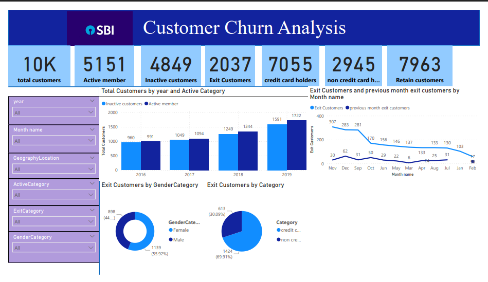

# Customer Churn Analysis Dashboard (Power BI)

## Overview
This project analyzes customer churn data using Power BI. The dashboard provides insights into customer activity, exit trends, credit card usage, and retention.

## Dataset Information

The dataset is organized into multiple files:

- CustomerInfo.csv → Customer details
- Bank Churn.csv → Customer churn information
- ActiveCustomer.xlsx → Active customer status
- ExitCustomer.xlsx → Exit customer data
- CreditCard.xlsx → Credit card ownership
- Gender.xlsx → Gender information
- Geography.xlsx → Customer location data

These files were combined and used to create the Power BI dashboard.

## Dashboard Features
- Total customers overview
- Active vs inactive customers analysis
- Exit customers trend by month
- Gender-based churn analysis
- Credit card holders analysis
- Customer retention insights

## Tools Used
- Power BI
- CSV Dataset
- Data Visualization

## Dashboard Preview

## Files in Repository
- Customer-Churn-Analysis.pbix → Power BI dashboard file
- datasets in xlsx  → Dataset used
- dashboard.png → Dashboard image preview

## Author
Srushti Bandi

